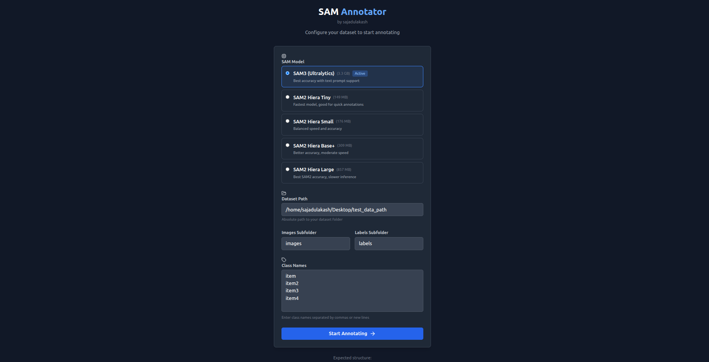
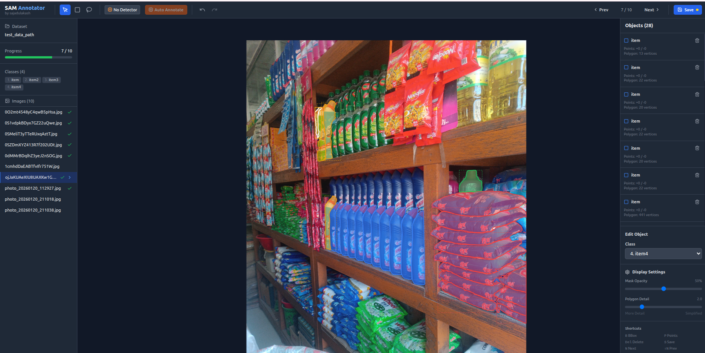

# SAM3 Polygon Annotation Tool

A web-based image annotation tool that uses **SAM 3** (Segment Anything Model) for efficient polygon segmentation annotations.

## Features

- **Interactive Segmentation**: Draw bounding boxes for initial mask, refine with lasso tool
- **Lasso Tool**: Add or subtract mask regions by drawing freeform shapes
- **SAM 3 Integration**: Fast, accurate mask predictions with multiple model options
- **Auto-Annotation**: YOLO detector + SAM3 for automatic object detection and segmentation
- **Multi-object Support**: Annotate multiple objects per image
- **YOLO Export**: Saves annotations in YOLO segmentation format (.txt)
- **Keyboard Shortcuts**: Efficient annotation workflow
- **Undo/Redo**: Full history support per image
- **Canvas Navigation**: Space+drag to pan, scroll to zoom

## Architecture

```
sam3/
├── backend/                 # FastAPI backend
│   ├── app/
│   │   ├── main.py         # FastAPI application
│   │   ├── routers/        # API endpoints
│   │   ├── services/       # SAM3, label, image services
│   │   ├── models/         # Pydantic models
│   │   └── utils/          # Utility functions
│   ├── requirements.txt
│   └── Dockerfile
├── frontend/               # React frontend
│   ├── src/
│   │   ├── components/     # React components
│   │   ├── hooks/          # Custom hooks
│   │   ├── services/       # API service
│   │   ├── store/          # State management
│   │   └── types/          # TypeScript types
│   ├── package.json
│   └── Dockerfile
└── docker-compose.yml
```

## Quick Start

### Prerequisites

- Python 3.10+
- Node.js 18+
- CUDA-capable GPU (recommended for SAM3)

### Backend Setup

```bash
cd backend
python -m venv venv
source venv/bin/activate  # On Windows: venv\Scripts\activate
pip install -r requirements.txt

# Download SAM3 model weights (place in backend/models/)
# Start the server
uvicorn app.main:app --reload --host 0.0.0.0 --port 8000
```

### Frontend Setup

```bash
cd frontend
npm install
npm run dev
```

### Docker Setup (Recommended)

```bash
docker-compose up --build
```

Access the application at `http://localhost:3000`

## Usage

1. **Configure Dataset**: Enter the path to your image folder and define class names
2. **Select Model**: Choose SAM2 variant or SAM3 model
3. **Draw Bounding Box**: Press `B` and drag to create a bbox around an object
4. **Refine with Lasso**: Press `L`, select Add (+) or Subtract (-) mode, then draw to modify mask
5. **Auto-Annotate**: Use YOLO detector + SAM3 for automatic annotation
6. **Assign Class**: Select from dropdown or press `1-9` for quick selection
7. **Save**: Press `S` or click Save to export annotations

## Keyboard Shortcuts

| Key | Action |
|-----|--------|
| `V` | Select tool |
| `B` | Bounding box tool |
| `L` | Lasso tool (mask editing) |
| `+` / `=` | Lasso add mode |
| `-` / `_` | Lasso subtract mode |
| `1-9` | Select class by index |
| `N` | Next image |
| `Shift+N` | Previous image |
| `Ctrl+S` | Save annotations |
| `Del` | Delete selected object |
| `Ctrl+Z` | Undo |
| `Ctrl+Y` | Redo |
| `Space+Drag` | Pan canvas |
| `Scroll` | Zoom |

## Output Format

Annotations are saved in YOLO segmentation format:

```
# labels/image001.txt
0 0.123 0.456 0.234 0.567 0.345 0.678 ...
1 0.111 0.222 0.333 0.444 0.555 0.666 ...
```

Each line: `class_id x1 y1 x2 y2 x3 y3 ...` (normalized coordinates)

## API Endpoints

| Endpoint | Method | Description |
|----------|--------|-------------|
| `/api/session/init` | POST | Initialize dataset session |
| `/api/images/{id}` | GET | Get image by ID |
| `/api/sam/predict` | POST | Run SAM3 prediction |
| `/api/labels/save` | POST | Save annotations |
| `/api/labels/{image_id}` | GET | Load existing labels |

## Configuration

### Environment Variables

**Backend** (`.env`):
```
SAM_MODEL_PATH=./models/sam3_vit_h.pth
ALLOWED_PATHS=/data/datasets,/home/user/images
MAX_IMAGE_SIZE=4096
EMBEDDING_CACHE_SIZE=100
```

**Frontend** (`.env`):
```
VITE_API_URL=http://localhost:8000
```

## Screenshots

### Setup Page


### Canvas / Annotation View


## License

MIT License
